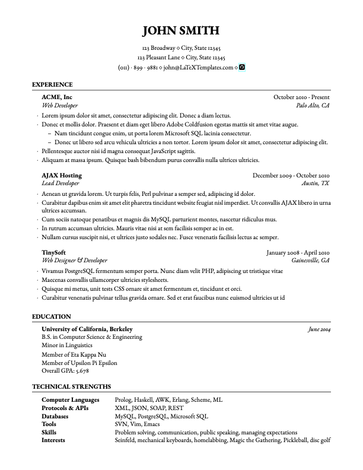

# medium-length-professional-cv

This is a modification of the [Medium Length Professional CV](https://www.latextemplates.com/template/medium-length-professional-cv).

The following changes have been made:
- `\sublist` command allows creating appropriately formatted nested lists in the `rSubsection`.
    - Traditional nested list commands such as `\begin{itemize}` work but the spacing does not match that of lists used in `rSubsection`
- Added social icons (GitHub, etc.) via `fontawesome` and hyperlinking via `hyperref`
- Added Skills & Interest section

